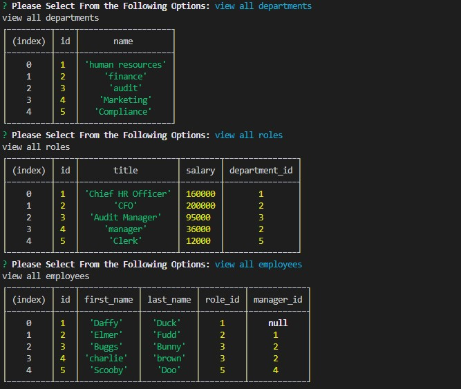
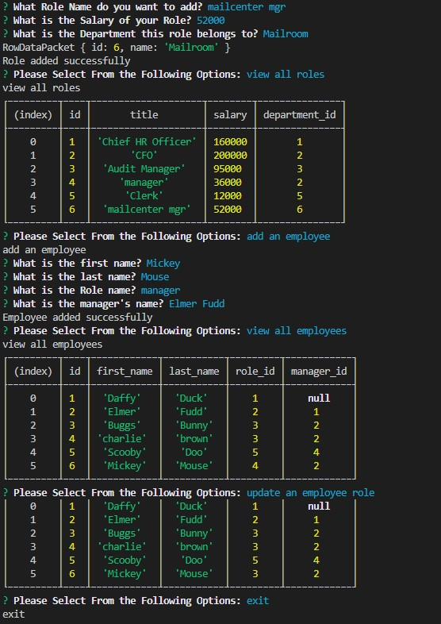

# employeetrackerfdh

AS a business owner, they want to be able to view and manage their departments, roles, and employees in their new company. To help organize and plan their business, they are given a command-line application that will accept their input.  When the application is started, the business owner is presented with the following options: view all departments, view all roles, view all employees, add a department, add a role, add an employee, and update an employee role. 
The business owner will take the following steps to view each selection in the database. 

When the department view is selected, the business owner is presented with a formatted table showing their department names and ids.  Next, when the option to view roles is selected, they are presented with the job title, role id, the department that role belongs to, and the salary for that role. Selecting the option to view employees, the business owner will be presented with a formatted table showing employee data, including employee ids, first names, last names, job titles, departments, salaries, and managers that the employees report to.  

When it comes to adding a department, business owner will enter the name of the department and that department is added to the database.  To add a role, the business manager will enter, the name, salary, and department for the role and that role is added to the database. To update an employee’s role, the business manager will select an employee to update and their new role and this information is updated in the database.  

The following functions created will help a business owner to organized their business and will have immediate access to his employee’s employment information. 

# Table of Contents

- [Installation](#installation)
- [Usage](#usage)
- [Roadmap](#roadmap)
- [Contributions](#contributions)
- [Questions](#questions)

## Installation

github: https://github.com/harrisfd/employeetrackerfdh

## Usage
Walkthrough Video: https://screencast-o-matic.com/watch/crhenAVeHDa

## Roadmap

Continuous updates to help improve the overall look of the new database for the business owner.  

## Contributions

No contributions at this time.

## Questions

Please email fharrisfoster@gmail.com for any questions.

